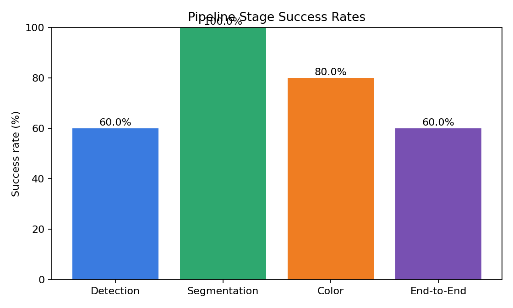
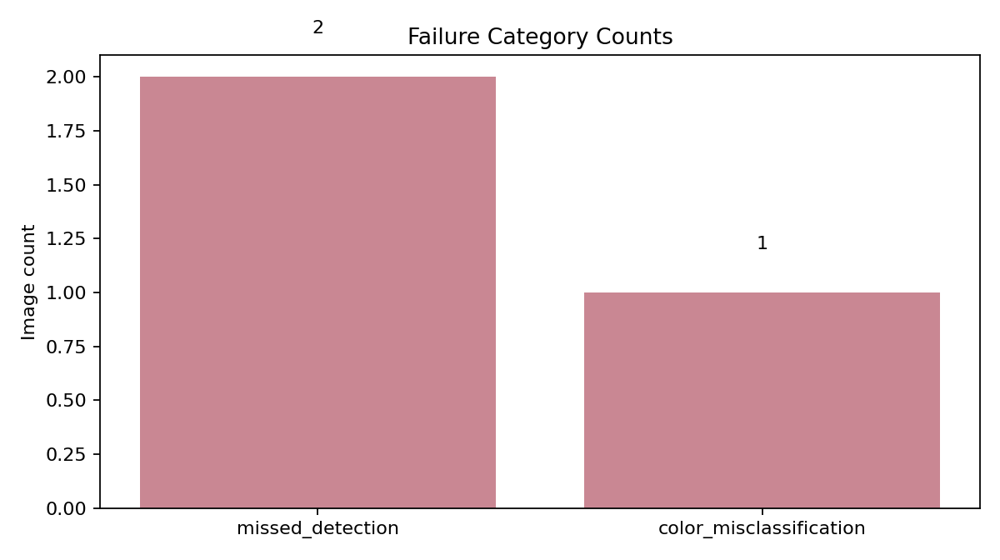
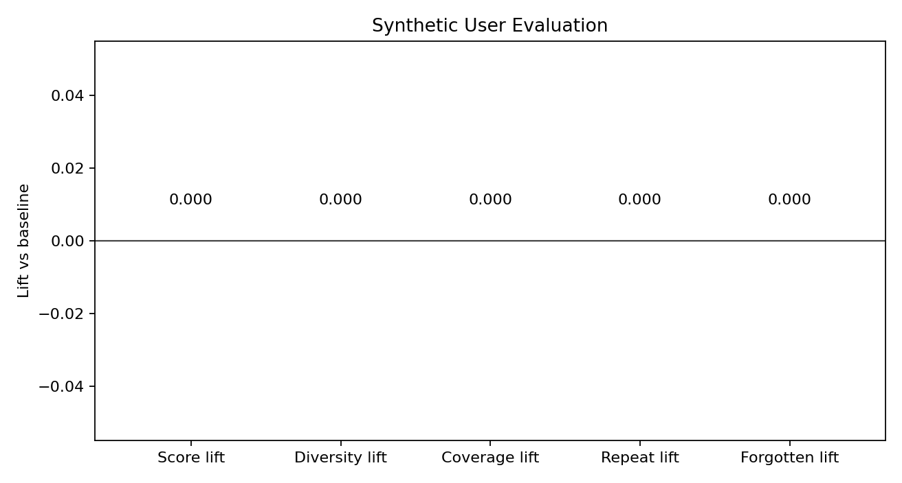

# Evaluation Report

## Executive Summary

- Dataset scanned: `C:\Users\amogh\Desktop\clothes`
- Images evaluated: `5`
- Detection proxy accuracy: `0.6`
- Segmentation success rate: `1.0`
- Color success rate: `0.8`
- End-to-end pipeline success rate: `0.6`

### Key Findings

- Detection remains the main reliability bottleneck on weak-label checks.
- Color extraction still needs attention on unstable or leakage-heavy masks.
- LAB-based color extraction is measurably more stable than the HSV baseline.

## Fixes Applied In This Build

- Stopped single-garment scans from duplicating one shirt into both top and bottom results.
- Redirected the profile save flow back to the homepage after a successful save.
- Added visible color swatches next to detected color names and palette entries in the scan UI.
- Improved the scan page layout so controls, status, and result cards use space more effectively.

## Dataset Profile

| Label bucket | Count |
|---|---:|
| full_outfit | 2 |
| unknown | 3 |

## Charts

## Vision Evaluation

| Metric | Value |
|---|---:|
| Mean mask quality score | 0.91 |
| Mean color stability score | 67.01 |
| Mean LAB drift | 2.9712 |
| Mean LAB improvement over HSV (%) | 4.0 |

### Failure Breakdown

| Failure | Count |
|---|---:|
| missed_detection | 2 |
| color_misclassification | 1 |

### Worst Images To Review

- `C:\Users\amogh\Desktop\clothes\111.jpg`
- `C:\Users\amogh\Desktop\clothes\-1117Wx1400H-467293008-brown-MODEL.avif`
- `C:\Users\amogh\Desktop\clothes\2.jpg`
- `C:\Users\amogh\Desktop\clothes\222.jpg`
- `C:\Users\amogh\Desktop\clothes\1.jpg`

## Synthetic User Recommendation Evaluation

- Simulation horizon: `60 days`
- Replicates: `3`
- Avg score lift: `None`
- Avg diversity lift: `None`
- Avg repetition-rate lift: `None`
- Avg coverage lift: `None`
- Avg forgotten-item-rate lift: `None`

## Generated Artifacts

- Vision JSON: `vision\vision_summary.json`
- Vision records: `vision\vision_records.json`
- Failure folders: `vision\failures`
- Worst images: `vision\top_20_worst`
- Recommender summary: `recommender\recommender_summary.json`

## How To Use This Report

- Use the stage success chart to explain where reliability drops first.
- Use the failure folders to show concrete examples of missed detection, poor segmentation, and color mistakes.
- Use the synthetic-user lifts to justify that the recommender is not just accurate, but also diverse and less repetitive.
