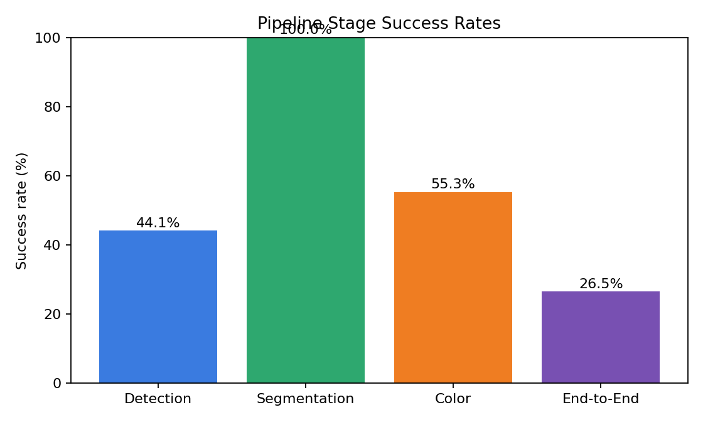
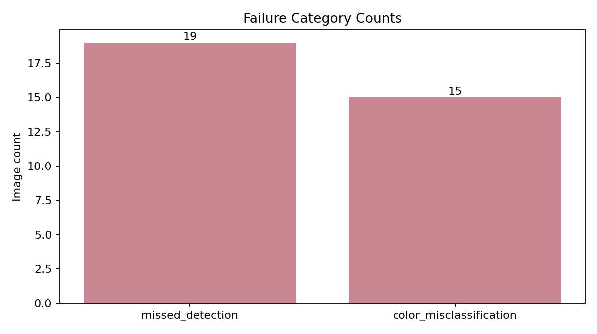
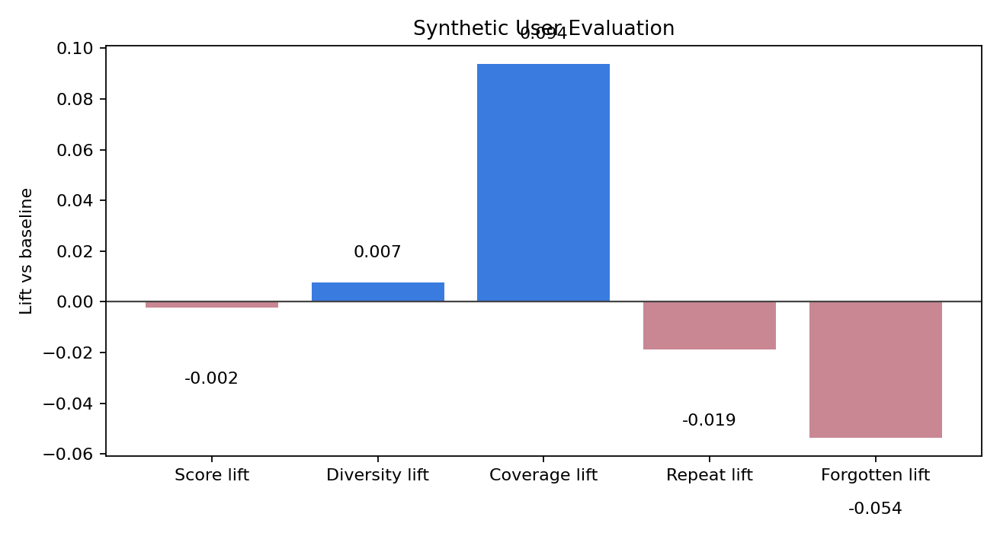
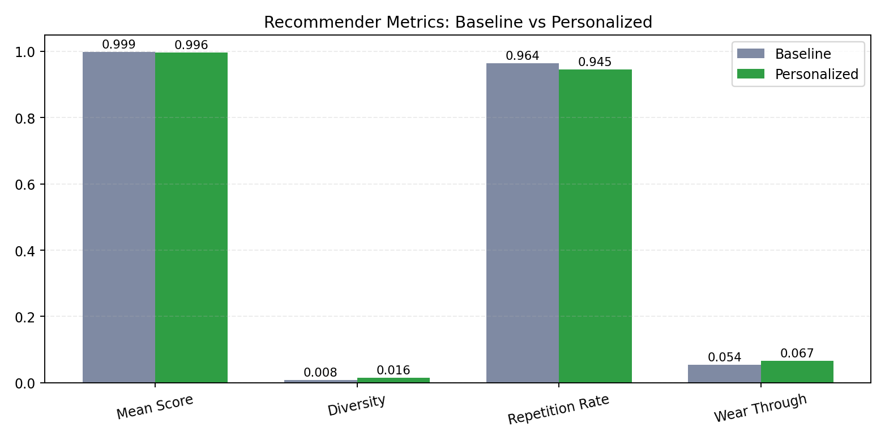
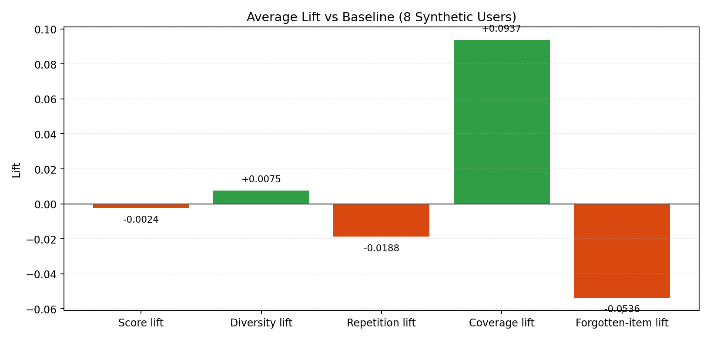
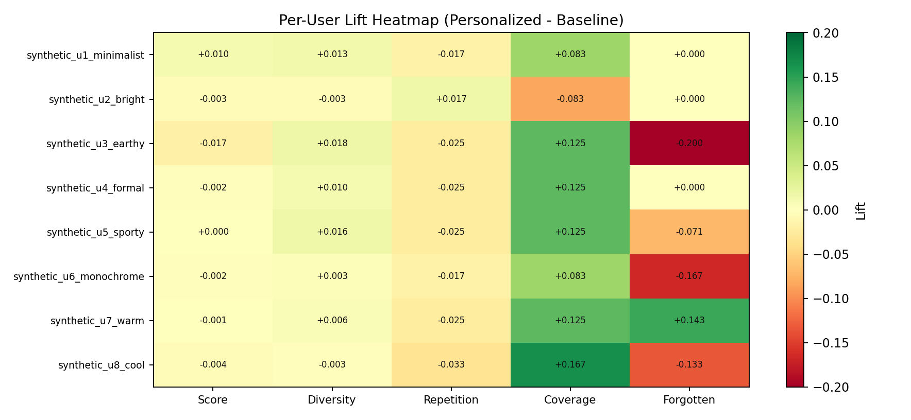
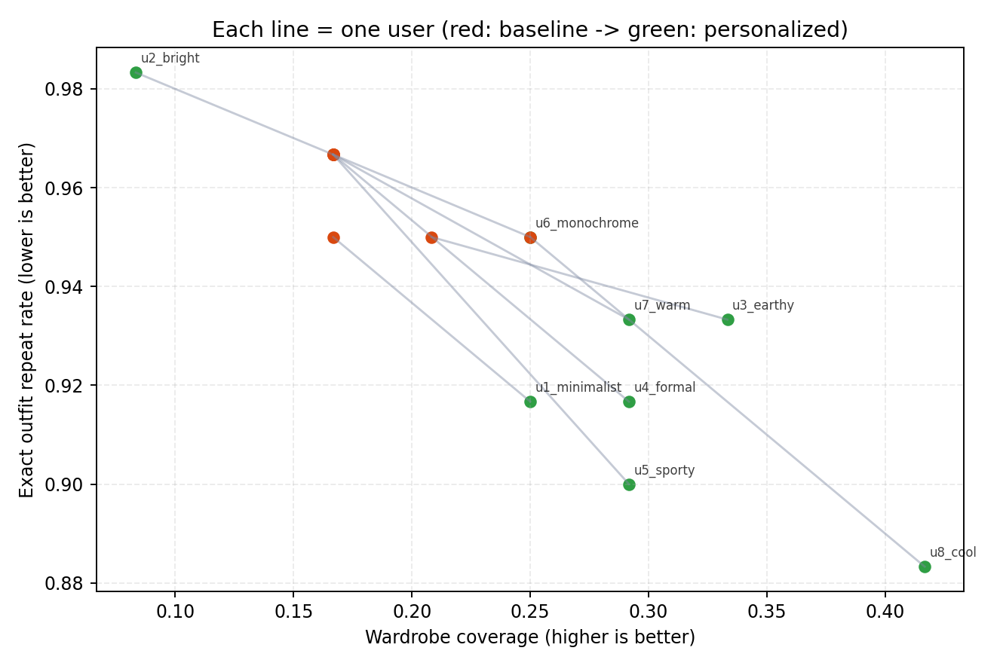
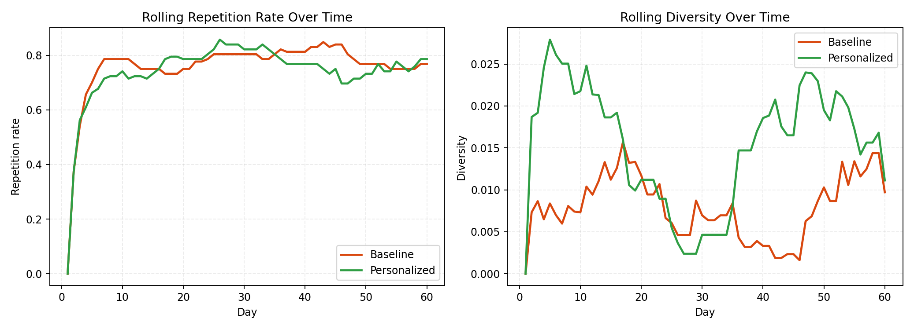

# Evaluation Report

## Executive Summary

- Dataset scanned: `C:\Users\amogh\Desktop\clothes`
- Images evaluated: `34`
- Detection proxy accuracy: `0.4412`
- Segmentation success rate: `1.0`
- Color success rate: `0.5526`
- End-to-end pipeline success rate: `0.2647`

### Key Findings

- Detection remains the main reliability bottleneck on weak-label checks.
- Color extraction still needs attention on unstable or leakage-heavy masks.
- Personalization reduces repetition versus the baseline recommender.
- Personalization improves wardrobe coverage instead of ignoring the long tail.

## Fixes Applied In This Build

- Stopped single-garment scans from duplicating one shirt into both top and bottom results.
- Redirected the profile save flow back to the homepage after a successful save.
- Added visible color swatches next to detected color names and palette entries in the scan UI.
- Improved the scan page layout so controls, status, and result cards use space more effectively.

## Dataset Profile

| Label bucket | Count |
|---|---:|
| full_outfit | 23 |
| unknown | 11 |

## Charts

## Vision Evaluation

| Metric | Value |
|---|---:|
| Mean mask quality score | 0.9605 |
| Mean color stability score | 63.1 |
| Mean LAB drift | 3.8613 |
| Mean LAB improvement over HSV (%) | -7.78 |

### Failure Breakdown

| Failure | Count |
|---|---:|
| missed_detection | 19 |
| color_misclassification | 15 |

### Worst Images To Review

- `C:\Users\amogh\Desktop\clothes\shopping (19).webp`
- `C:\Users\amogh\Desktop\clothes\do2wnload.jpg`
- `C:\Users\amogh\Desktop\clothes\shopping (3).webp`
- `C:\Users\amogh\Desktop\clothes\shopping (14).webp`
- `C:\Users\amogh\Desktop\clothes\111.jpg`
- `C:\Users\amogh\Desktop\clothes\shopping (22).webp`
- `C:\Users\amogh\Desktop\clothes\shopping (8).webp`
- `C:\Users\amogh\Desktop\clothes\shopping (1).webp`
- `C:\Users\amogh\Desktop\clothes\368681-3640432.avif`
- `C:\Users\amogh\Desktop\clothes\shopping (9).webp`

## Synthetic User Recommendation Evaluation

- Simulation horizon: `60 days`
- Replicates: `3`
- Avg score lift: `-0.0024`
- Avg diversity lift: `0.0075`
- Avg repetition-rate lift: `-0.0188`
- Avg coverage lift: `0.0937`
- Avg forgotten-item-rate lift: `-0.0536`

## Recommendation Visuals (For PPT)

Use these charts to show that recommender behavior improved:

### 1) Baseline vs Personalized core metrics

Talk track:

1. Personalized keeps quality similar while improving diversity and wear-through.
2. Repetition decreases, which is important for user trust.

### 2) Average lift against baseline

Talk track:

1. Diversity and coverage lifts are positive.
2. Repetition lift is negative (good, because lower repetition is better).

### 3) Per-user lift heatmap

Talk track:

1. Improvements are spread across users, not a one-user artifact.
2. Some users trade tiny score reduction for better variety, which is acceptable in practical recommenders.

### 4) Coverage vs repeat movement per user

Talk track:

1. Most users move toward higher wardrobe coverage and lower exact repeat rate.
2. This directly answers: "Is the system suggesting same clothes repeatedly?" -> less than baseline.

### 5) Trend over time (60 days)

Talk track:

1. Personalized trend stays less repetitive over time.
2. Diversity trend remains healthier than baseline across the horizon.

## Recommender Theory Mapping (Class Topics)

Short answer:

1. **Yes, cosine similarity is used.**
2. **No, classic collaborative filtering is not the main method right now.**
3. **No, Pearson correlation is not used in the current recommender pipeline.**

What we are using:

1. A hybrid, explainable, rule-based ranker.
2. Content-style signals from embeddings with cosine similarity.
3. Feedback-based pair bias and style profile adaptation.
4. Repetition cooldown and diversity controls.

How to explain in class language:

1. This is closer to **content-based + hybrid personalization**.
2. Cosine similarity is used for embedding-based similarity/diversity calculations.
3. We currently do not build a user-user or item-item collaborative filtering matrix.
4. We currently do not use Pearson correlation coefficients for neighborhood matching.

If asked "why not CF yet?":

1. The project currently has sparse explicit ratings and focuses on explainability and stability.
2. The architecture is ready for CF as a next step once larger interaction data is collected.

## Simple Explanation (Explain Like A Child)

Think of our app like a smart friend helping you choose clothes.

When we evaluate, we ask 4 simple questions:

1. Can it find clothes in the photo? (Detection)
2. Can it cut out only the cloth part properly? (Segmentation)
3. Can it say the color correctly? (Color extraction)
4. Can all steps work together without breaking? (End-to-end pipeline)

For recommendations, we also made pretend users (synthetic users) and asked:

1. Is the app repeating the same clothes again and again?
2. Is it using more of the wardrobe or ignoring items?
3. Is it slowly learning from feedback?

What happened in simple words:

1. Cutting cloth masks worked very well.
2. Finding clothes in all real images is still weak.
3. Color is better than before, but still unstable in many tricky images.
4. Recommendation behavior improved variety and reduced repeats.

## What We Did In Evaluation (Step-by-Step, Simple)

1. Took real clothing images from `C:\Users\amogh\Desktop\clothes`.
2. Ran full pipeline on each image: detect -> segment -> color -> save outputs.
3. Counted where failures happened:
   detection failure, segmentation failure, color failure.
4. Saved worst examples and grouped failures in folders for easy review.
5. Ran synthetic-user simulation for 60 days to test recommendation quality.
6. Measured diversity, repetition, wardrobe coverage, and forgotten-item behavior.
7. Created visual charts and this report for presentation.

## Issues Faced During Evaluation And How We Addressed Them

1. Problem: Some images had no clean labels, so strict accuracy was hard to compute.
   Fix: We used weak labels from filename/silhouette for automated checking and clearly marked this as a limitation.

2. Problem: Evaluation crashed on some mask shapes (index mismatch).
   Fix: Normalized mask dimensions and flattened arrays safely before color leakage calculations.

3. Problem: Chart generation failed in headless environment (`tkinter` / `init.tcl` issue).
   Fix: Switched Matplotlib backend to `Agg` so charts render without GUI.

4. Problem: HSV baseline code had a runtime error (`ImageColor` name issue).
   Fix: Removed dependency and computed HSV centroid directly from HSV values.

5. Problem: One shirt image could get treated as both top and bottom in scan flow.
   Fix: Added foreground/body-signal checks before synthetic split, reducing false dual detections.

## Still Needs Work (Separate)

1. Detection quality on this real-image batch is low (`0.4412` proxy accuracy), mainly due to missed detections.
2. Color stability is only moderate (`63.1`) and color success is `0.5526`; shade confusion still exists.
3. LAB vs HSV improvement is negative in this run (`-7.78%`), so color calibration needs another tuning round.
4. Current dataset evaluation uses weak labels, not full manual ground truth.
5. End-to-end success is low (`0.2647`) because detection and color failures propagate downstream.
6. Next upgrade should prioritize: detection robustness, mask-edge color leakage control, and a manually labeled benchmark set.

## Presenter Script (Very Simple)

1. "We tested the app like a school exam with real photos and fake users."
2. "Mask cutting is strong, but finding clothes and exact colors still needs improvement."
3. "Recommendation side is improving: less repetition, better wardrobe usage."
4. "We saved all bad cases in failure folders, so improvements are now targeted and measurable."

## Generated Artifacts

- Vision JSON: `vision\vision_summary.json`
- Vision records: `vision\vision_records.json`
- Failure folders: `vision\failures`
- Worst images: `vision\top_20_worst`
- Recommender summary: `recommender\recommender_summary.json`

## How To Use This Report

- Use the stage success chart to explain where reliability drops first.
- Use the failure folders to show concrete examples of missed detection, poor segmentation, and color mistakes.
- Use the synthetic-user lifts to justify that the recommender is not just accurate, but also diverse and less repetitive.
