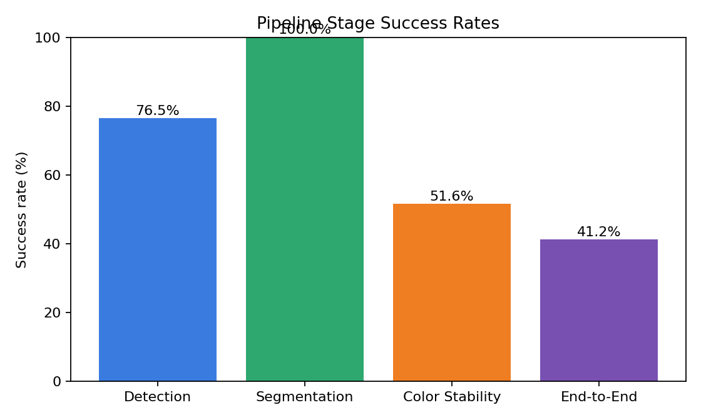
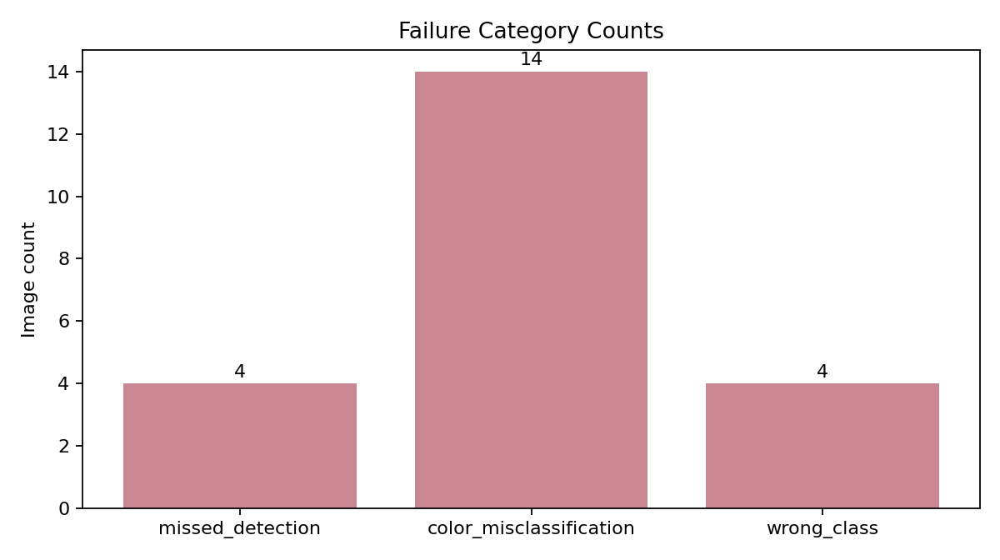

# Evaluation Report

## Executive Summary

- Dataset scanned: `C:\Users\amogh\Desktop\clothes`
- Images evaluated: `34`
- Detection proxy accuracy: `0.7647`
- Segmentation success rate: `1.0`
- Color stability pass rate: `0.5161`
- End-to-end pipeline success rate: `0.4118`

### Key Findings

- Detection remains the main reliability bottleneck on weak-label checks.
- Color extraction still needs attention on unstable or leakage-heavy masks (stability pass metric).
- Personalization reduces repetition versus the baseline recommender.
- Personalization improves wardrobe coverage instead of ignoring the long tail.

## Fixes Applied In This Build

## Dataset Profile

| Label bucket | Count |
|---|---:|
| full_outfit | 1 |
| lower_only | 14 |
| upper_only | 19 |

## Charts

## Vision Evaluation

| Metric | Value |
|---|---:|
| Mean mask quality score | 0.9871 |
| Mean color stability score | 63.2 |
| Color stability pass rate | 0.5161 |
| Mean LAB drift | 4.0433 |
| Mean LAB improvement over HSV (%) | -7.83 |

### Failure Breakdown

| Failure | Count |
|---|---:|
| missed_detection | 4 |
| color_misclassification | 14 |
| wrong_class | 4 |

### Worst Images To Review

- `C:\Users\amogh\Desktop\clothes\1.jpg`
- `C:\Users\amogh\Desktop\clothes\2.jpg`
- `C:\Users\amogh\Desktop\clothes\368681-3640432.avif`
- `C:\Users\amogh\Desktop\clothes\shopping (10).webp`
- `C:\Users\amogh\Desktop\clothes\shopping (20).webp`
- `C:\Users\amogh\Desktop\clothes\shopping (11).webp`
- `C:\Users\amogh\Desktop\clothes\shopping (16).webp`
- `C:\Users\amogh\Desktop\clothes\shopping (15).webp`
- `C:\Users\amogh\Desktop\clothes\shopping (21).webp`
- `C:\Users\amogh\Desktop\clothes\shopping (19).webp`

## Synthetic User Recommendation Evaluation

- Simulation horizon: `60 days`
- Replicates: `3`
- Avg score lift: `0.1284`
- Avg diversity lift: `0.0103`
- Avg repetition-rate lift: `-0.0042`
- Avg coverage lift: `0.0208`
- Avg forgotten-item-rate lift: `-0.1738`

## Generated Artifacts

- Vision JSON: `vision\vision_summary.json`
- Vision records: `vision\vision_records.json`
- Failure folders: `vision\failures`
- Worst images: `vision\top_20_worst`
- Recommender summary: `recommender\recommender_summary.json`

## How To Use This Report

- Use the stage success chart to explain where reliability drops first.
- Use the failure folders to show concrete examples of missed detection, poor segmentation, and color mistakes.
- Use the synthetic-user lifts to justify that the recommender is not just accurate, but also diverse and less repetitive.
