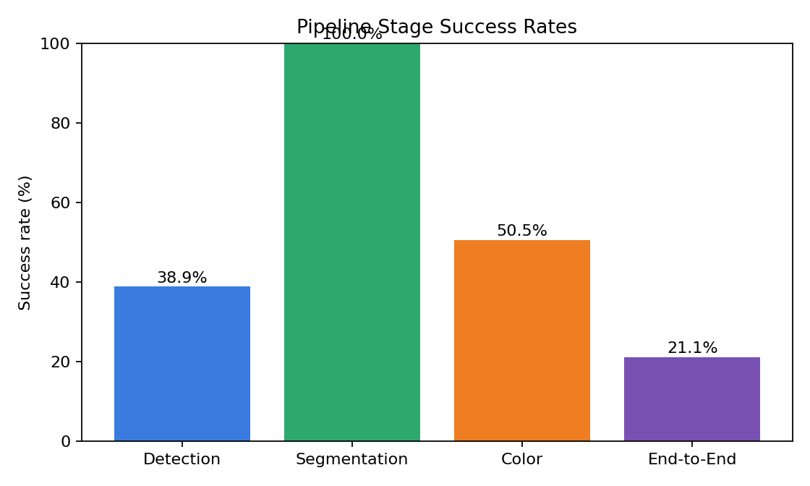
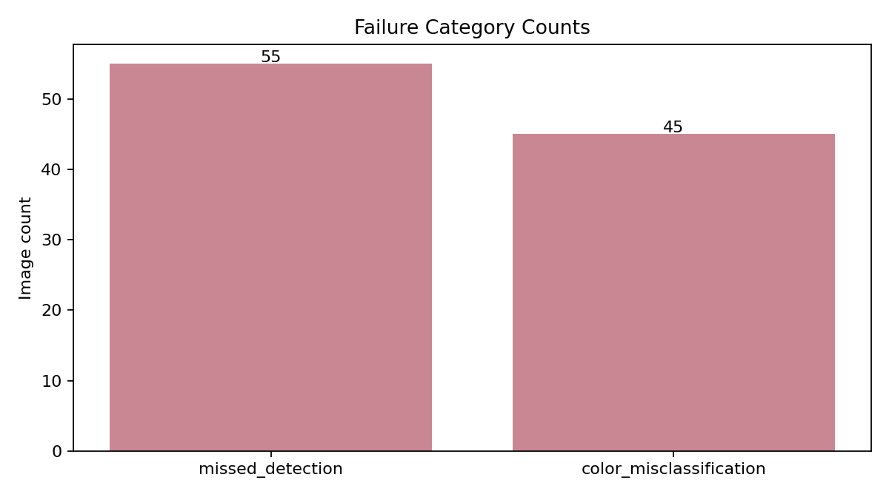

# Evaluation Report

## Executive Summary

- Dataset scanned: `C:\Users\amogh\Desktop\new clothes`
- Images evaluated: `90`
- Detection proxy accuracy: `0.3889`
- Segmentation success rate: `1.0`
- Color success rate: `0.5055`
- End-to-end pipeline success rate: `0.2111`

### Key Findings

- Detection remains the main reliability bottleneck on weak-label checks.
- Color extraction still needs attention on unstable or leakage-heavy masks.
- Personalization reduces repetition versus the baseline recommender.
- Personalization improves wardrobe coverage instead of ignoring the long tail.

## Fixes Applied In This Build

- Stopped single-garment scans from duplicating one shirt into both top and bottom results.
- Redirected the profile save flow back to the homepage after a successful save.
- Added visible color swatches next to detected color names and palette entries in the scan UI.
- Improved the scan page layout so controls, status, and result cards use space more effectively.

## Dataset Profile

| Label bucket | Count |
|---|---:|
| full_outfit | 57 |
| unknown | 33 |

## Charts

## Vision Evaluation

| Metric | Value |
|---|---:|
| Mean mask quality score | 0.95 |
| Mean color stability score | 59.99 |
| Mean LAB drift | 4.0863 |
| Mean LAB improvement over HSV (%) | -9.84 |

### Failure Breakdown

| Failure | Count |
|---|---:|
| missed_detection | 55 |
| color_misclassification | 45 |

### Worst Images To Review

- `C:\Users\amogh\Desktop\new clothes\1ab8de40-39ef-4528-8186-cdb9bfaab2bc.jpg`
- `C:\Users\amogh\Desktop\new clothes\a85064d6-0f5d-4fce-9e3a-d1b5902c6098.jpg`
- `C:\Users\amogh\Desktop\new clothes\5a1bcd89-5b3d-41a1-80a7-0665c2ce7f86.jpg`
- `C:\Users\amogh\Desktop\new clothes\d8c20701-80af-4d6c-b8fb-9c4535860b4b.jpg`
- `C:\Users\amogh\Desktop\new clothes\ff0535f7-c9f4-47f7-8aae-373aa3e09f04.jpg`
- `C:\Users\amogh\Desktop\new clothes\3ea9b190-582d-474b-9ba1-1fbabb2a2435.jpg`
- `C:\Users\amogh\Desktop\new clothes\2d88dcfb-2418-49fa-82b2-b5d4500ed542.jpg`
- `C:\Users\amogh\Desktop\new clothes\7c546852-22a8-468c-8c46-c1f4a13dec6b.jpg`
- `C:\Users\amogh\Desktop\new clothes\6d08108f-89b2-4b59-afba-8f85892bffa7.jpg`
- `C:\Users\amogh\Desktop\new clothes\53c2539d-a472-4a71-88d8-6c0aaf0fe1eb.jpg`

## Synthetic User Recommendation Evaluation

- Simulation horizon: `60 days`
- Replicates: `3`
- Avg score lift: `0.1284`
- Avg diversity lift: `0.0103`
- Avg repetition-rate lift: `-0.0042`
- Avg coverage lift: `0.0208`
- Avg forgotten-item-rate lift: `-0.1738`

## Generated Artifacts

- Vision JSON: `vision\vision_summary.json`
- Vision records: `vision\vision_records.json`
- Failure folders: `vision\failures`
- Worst images: `vision\top_20_worst`
- Recommender summary: `recommender\recommender_summary.json`

## How To Use This Report

- Use the stage success chart to explain where reliability drops first.
- Use the failure folders to show concrete examples of missed detection, poor segmentation, and color mistakes.
- Use the synthetic-user lifts to justify that the recommender is not just accurate, but also diverse and less repetitive.
