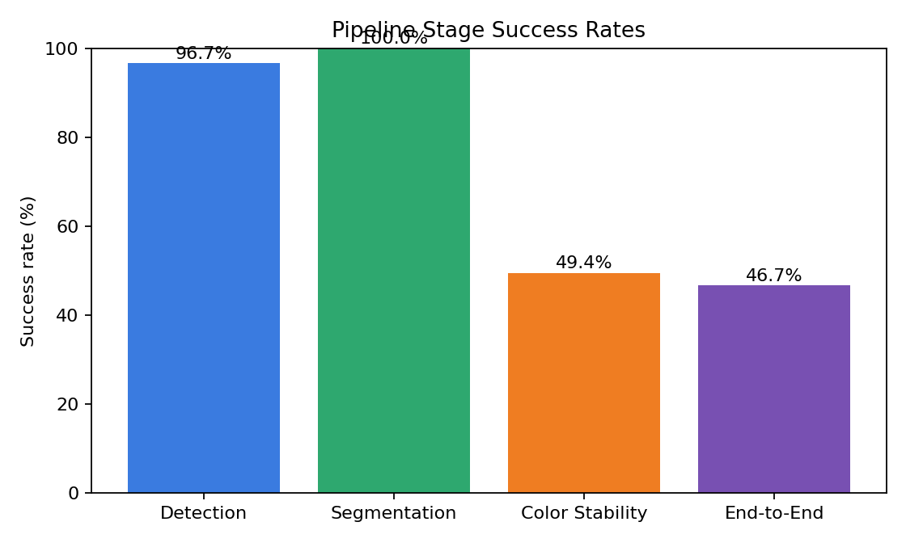
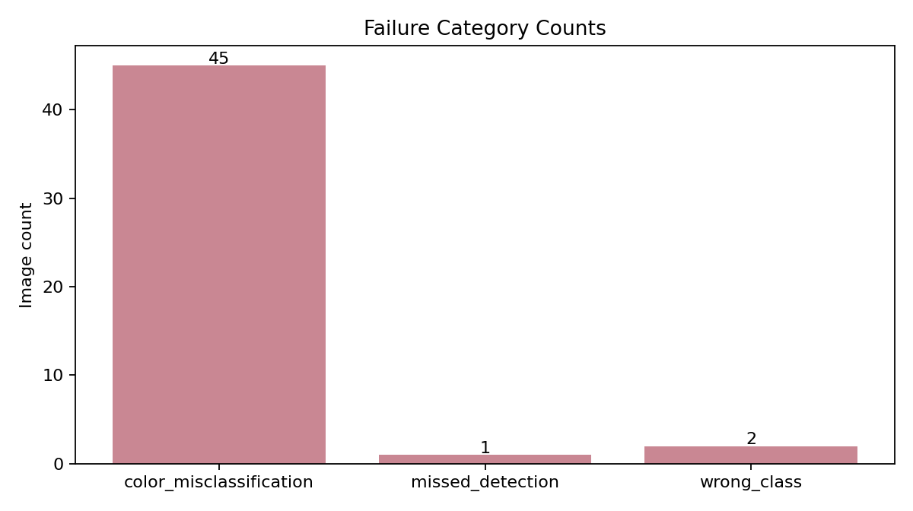
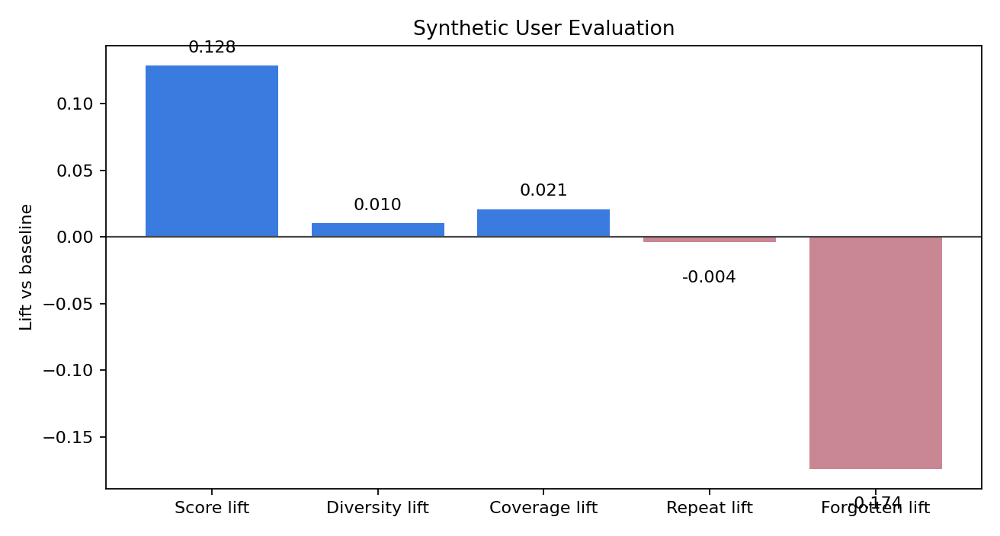

# Evaluation Report

## Executive Summary

- Dataset scanned: `C:\Users\amogh\Desktop\new clothes`
- Images evaluated: `90`
- Detection proxy accuracy: `0.9667`
- Segmentation success rate: `1.0`
- Color stability pass rate: `0.4944`
- End-to-end pipeline success rate: `0.4667`

### Key Findings

- Color extraction still needs attention on unstable or leakage-heavy masks (stability pass metric).
- Personalization reduces repetition versus the baseline recommender.
- Personalization improves wardrobe coverage instead of ignoring the long tail.

## Fixes Applied In This Build

## Dataset Profile

| Label bucket | Count |
|---|---:|
| lower_only | 55 |
| unknown | 1 |
| upper_only | 34 |

## Charts

## Vision Evaluation

| Metric | Value |
|---|---:|
| Mean mask quality score | 0.9489 |
| Mean color stability score | 59.82 |
| Color stability pass rate | 0.4944 |
| Mean LAB drift | 4.1117 |
| Mean LAB improvement over HSV (%) | -9.9 |

### Failure Breakdown

| Failure | Count |
|---|---:|
| color_misclassification | 45 |
| missed_detection | 1 |
| wrong_class | 2 |

### Worst Images To Review

- `C:\Users\amogh\Desktop\new clothes\1ab8de40-39ef-4528-8186-cdb9bfaab2bc.jpg`
- `C:\Users\amogh\Desktop\new clothes\4d591b2d-59aa-4977-9f27-db69929cb9d8.jpg`
- `C:\Users\amogh\Desktop\new clothes\e102d2b6-60a1-427c-94d2-8ab6876cce30.jpg`
- `C:\Users\amogh\Desktop\new clothes\a85064d6-0f5d-4fce-9e3a-d1b5902c6098.jpg`
- `C:\Users\amogh\Desktop\new clothes\27d89ad3-f25b-4bec-a824-8e2d881c2d4f.jpg`
- `C:\Users\amogh\Desktop\new clothes\5a1bcd89-5b3d-41a1-80a7-0665c2ce7f86.jpg`
- `C:\Users\amogh\Desktop\new clothes\53e1ebfe-5216-4c95-b166-bee422a056f6.jpg`
- `C:\Users\amogh\Desktop\new clothes\58e81b94-b56b-4cab-85aa-c5990a81c249.jpg`
- `C:\Users\amogh\Desktop\new clothes\5927c07b-c5cb-4167-9fda-9e6dd22fc872.jpg`
- `C:\Users\amogh\Desktop\new clothes\d8c20701-80af-4d6c-b8fb-9c4535860b4b.jpg`

## Synthetic User Recommendation Evaluation

- Simulation horizon: `60 days`
- Replicates: `3`
- Avg score lift: `0.1284`
- Avg diversity lift: `0.0103`
- Avg repetition-rate lift: `-0.0042`
- Avg coverage lift: `0.0208`
- Avg forgotten-item-rate lift: `-0.1738`

## Generated Artifacts

- Vision JSON: `vision\vision_summary.json`
- Vision records: `vision\vision_records.json`
- Failure folders: `vision\failures`
- Worst images: `vision\top_20_worst`
- Recommender summary: `recommender\recommender_summary.json`

## How To Use This Report

- Use the stage success chart to explain where reliability drops first.
- Use the failure folders to show concrete examples of missed detection, poor segmentation, and color mistakes.
- Use the synthetic-user lifts to justify that the recommender is not just accurate, but also diverse and less repetitive.
